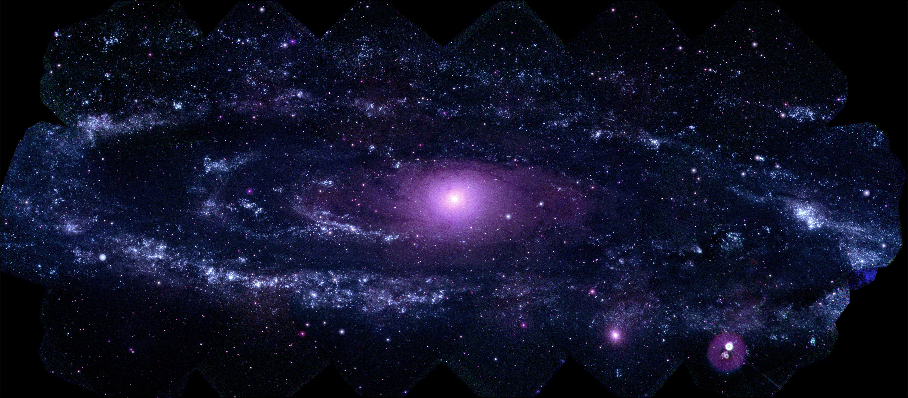

<!-- README.md is generated from README.Rmd. Please edit that file -->
astropic
========

The goal of `astropic` is to connect R to the NASA APOD API. The APOD API supports one image at a time. In order to suplly more than that, this package also includes creating time ranges (of less than 1000 days ata time) and some historical data in tibble format.

Thanks to Michael W. Kearney, author of [Rtweet](http://rtweet.info), for having a robust package based on connecting to an API. I didn't know much about APIs when I started this project and looking at his source code helped a ton!

Installation
------------

You can install the development version from [GitHub](https://github.com/) with:

``` r
# install.packages("devtools")
devtools::install_github("eringrand/apodR")
```

Query
-----

The query paramters are described on the [APOD API Github page](https://github.com/nasa/apod-api) as such...

-   `date` A string in YYYY-MM-DD format indicating the date of the APOD image (example: 2014-11-03). Defaults to today's date. Must be after 1995-06-16, the first day an APOD picture was posted. There are no images for tomorrow available through this API.
-   `concept_tags` A boolean indicating whether concept tags should be returned with the rest of the response. The concept tags are not necessarily included in the explanation, but rather derived from common search tags that are associated with the description text. (Better than just pure text search.) Defaults to False.
-   `hd` A boolean parameter indicating whether or not high-resolution images should be returned. This is present for legacy purposes, it is always ignored by the service and high-resolution urls are returned regardless.
-   `count` A positive integer, no greater than 100. If this is specified then `count` randomly chosen images will be returned in a JSON array. Cannot be used in conjunction with `date` or `start_date` and `end_date`.
-   `start_date` A string in YYYY-MM-DD format indicating the start of a date range. All images in the range from `start_date` to `end_date` will be returned in a JSON array. Cannot be used with `date`.
-   `end_date` A string in YYYY-MM-DD format indicating that end of a date range. If `start_date` is specified without an `end_date` then `end_date` defaults to the current date.

Example
-------

This is a basic example to retrive APOD data.

### Basic Example

``` r
library(apodR)
get_apod() # no inputs will get today's image
#> Warning in strptime(x, fmt, tz = "GMT"): unknown timezone 'zone/tz/2018c.
#> 1.0/zoneinfo/America/New_York'
#> # A tibble: 1 x 7
#>   date       explanation      hdurl media_type service_version title url  
#>   <chr>      <chr>            <chr> <chr>      <chr>           <chr> <chr>
#> 1 2018-04-04 The robotic rov… http… image      v1              Intr… http…
```

### Providing a date range

You can also supply a start and end date to get a range of image results back.

``` r
get_apod(query  = list(start_date = "2018-04-01", end_date = "2018-04-03"))
#> # A tibble: 3 x 8
#>   copyright date  explanation hdurl media_type service_version title url  
#> * <chr>     <chr> <chr>       <chr> <chr>      <chr>           <chr> <chr>
#> 1 Fernando… 2018… I love you… http… image      v1              I Br… http…
#> 2 <NA>      2018… While crui… http… image      v1              Moon… http…
#> 3 Sergei M… 2018… You may ha… http… image      v1              The … http…
```

With a little `magick` you can also save the APOD image to your computer for use later. This is a demostration of a picture in APOD I helped to create!

``` r
library(magick)
#> Warning: package 'magick' was built under R version 3.4.4
#> Linking to ImageMagick 6.9.9.39
#> Enabled features: cairo, fontconfig, freetype, lcms, pango, rsvg, webp
#> Disabled features: fftw, ghostscript, x11
library(gmp)
#> Warning: package 'gmp' was built under R version 3.4.1
#> 
#> Attaching package: 'gmp'
#> The following objects are masked from 'package:base':
#> 
#>     %*%, apply, crossprod, matrix, tcrossprod
library(stringr)
#> Warning: package 'stringr' was built under R version 3.4.3
library(dplyr)
#> Warning: package 'dplyr' was built under R version 3.4.2
#> 
#> Attaching package: 'dplyr'
#> The following objects are masked from 'package:stats':
#> 
#>     filter, lag
#> The following objects are masked from 'package:base':
#> 
#>     intersect, setdiff, setequal, union

save_image <- function(url){
  image <- try(image_read(url), silent = FALSE)
  image_name <- stringr::str_extract(m31$hdurl, "([^\\/]+$)")
  image_loc <- here::here("man/figures/README", image_name)
  if(class(image)[1] != "try-error"){
    image %>%
    image_write(image_loc)
  }
  return(image)
}

m31 <- get_apod(query = list(date = "2009-09-17"))  # only providing a start date will give the image just for that day
pull(m31, explanation)
#> [1] "Taken by a telescope onboard NASA's Swift satellite, this stunning vista represents the highest resolution image ever made of the Andromeda Galaxy (aka M31) - at ultraviolet wavelengths. The mosaic is composed of 330 individual images covering a region 200,000 light-years wide. It shows about 20,000 sources, dominated by hot, young stars and dense star clusters that radiate strongly in energetic ultraviolet light. Of course, the Andromeda Galaxy is the closest large spiral galaxy to our own Milky Way, at a distance of some 2.5 million light-years. To compare this gorgeous island universe's appearance in optical light with its ultraviolet portrait, just slide your cursor over the image.   digg_url ='http://apod.nasa.gov/apod/ap090917.html'; digg_skin = 'compact';"
save_image(m31$hdurl)
```




Please note that this project is released with a [Contributor Code of Conduct](.github/CODE_OF_CONDUCT.md). By participating in this project you agree to abide by its terms.
